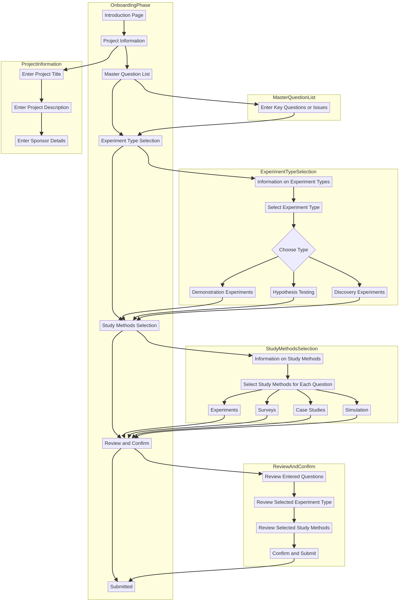

# Onboarding Phase of the Initiation Stage

Welcome to the Onboarding Phase of the Initiation Stage for the Experimentation Department. This section guides you through the initial steps required to start an experiment. The onboarding phase includes the following steps:

1. [Project Information](./project_information.md)
2. [Master Question List](./master_question_list.md)
3. [Experiment Type Selection](./experiment_type_selection.md)
4. [Study Methods Selection](./study_methods_selection.md)
5. [Review and Confirm](./review_and_confirm.md)

For definitions of key terms and concepts, refer to the [Definitions](./definitions.md) page.
